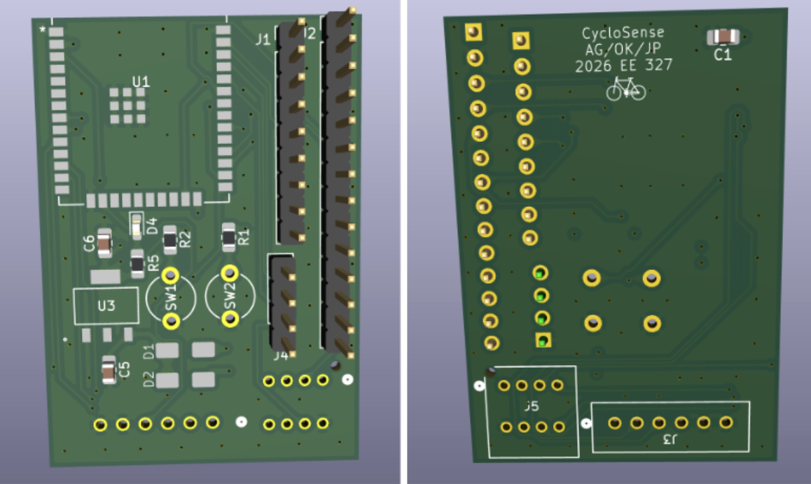
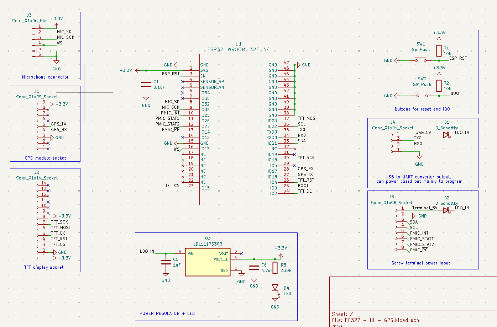
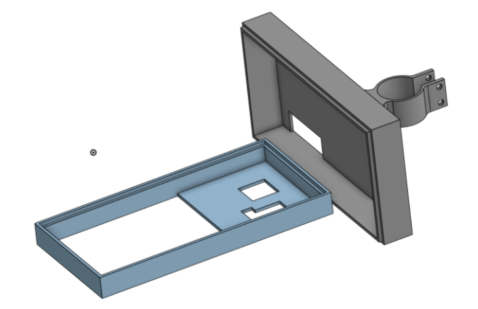
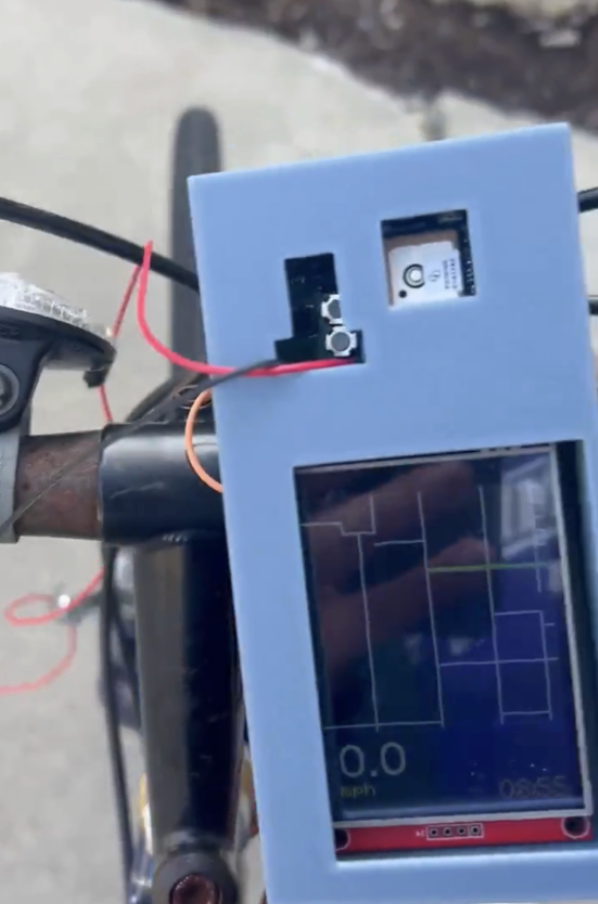

# CycloSense
# EE 327 Spring 2026

This repository contains the files for the firmware, PCB design, and 3D models used to create our bike computer named CycloSense. CycloSense was created to be a bike computer for the everyday bike user, affordable, easy to use, and includes predictive maintenance alerts and offline navigation. 

